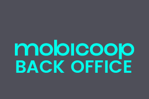

# Mobicoop-admin

BackOffice in front of coviride API

  

### Test

`npm test` will lauch tests

### Start

To start the application simply enter :

`npm start`

& just go [http://localhost:8082](http://localhost:8082)

### Licence
Mobicoop software is owned by Mobicoop cooperative. Mobicoop cooperative is opened to any individual, company or public authority who wish to become a shareholder.
In order to increase the impact of our platform to any sort of clients whatever type of contractual relationship theyu require, Mobicoop software is dual-licensed:
 - [AGPL-3](https://www.gnu.org/licenses/agpl-3.0)
 - proprietary software 

