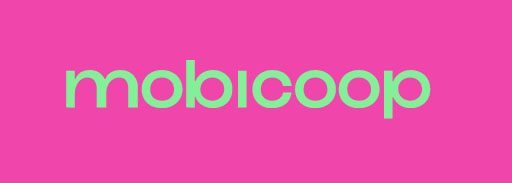
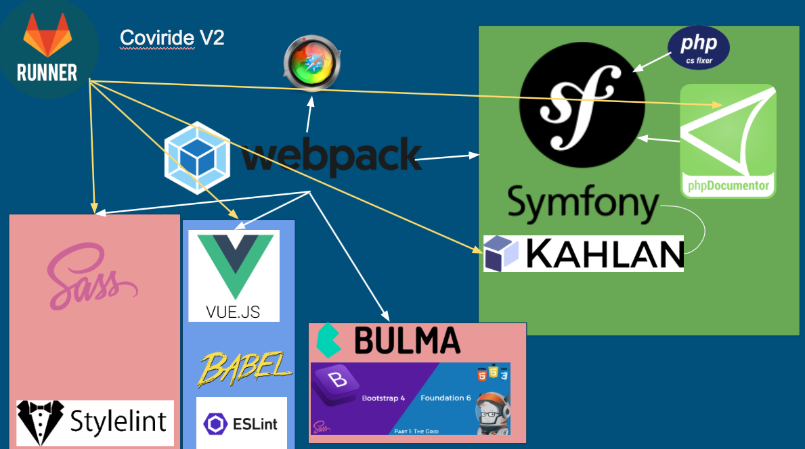

Mobicoop
=======

  
  
  
  

### About mobicoop

Interface which displays carpools available on a territory and allows connection between carpoolers making the same trip daily or punctually.

*This app is useless without any api behind it 🤯* don't forget to install & configure our [api](https://gitlab.com/mobicoop/mobicoop-api)

### Requirements 💻

- PHP: =>7.1
- Composer =>1.7
- Node.js => 10
- xdebug (needed for code-coverage)
- Google Chrome (for funcitonnals tests)

- for Windows check the [windows requirement](#windows-requirements) part

### Install 🤖

- Clone the repo

`git clone https://gitlab.com/mobicoop/mobicoop`

`cd mobicoop`

- Install symfony dependencies & npm dependencies
`composer install && npm install`

-Build assets files 
`npm run compile`

-Download tools for dev 
`npm run postinstall`

- On unix systems: `chmod 775 bin/*`

- Edit [.env](.env) file (check [Stuff for devs Section](#stuff-for-devs))

### Tests 🎰

-We use [Kahlan](https://kahlan.github.io/docs/) to create units/functionnals tests, you can launch them easily with:
-For functionnals tests you can do it via 3 ways, with [kernels](https://api.symfony.com/4.1/Symfony/Component/HttpKernel/Kernel.html) (limited--), with [client](https://api.symfony.com/4.1/Symfony/Component/HttpKernel/Client.html) (limited), with [panther](https://github.com/symfony/panther) for a real browser testing (click,form ..)

`vendor\bin\kahlan --cc=true --reporter=verbose` for cmd/powershell

Or just:

`npm test` On unix systems

### Start 🚀

To start the application simply enter :

`npm start`

& just go [http://localhost:8081](http://localhost:8001) 

### Developpement

To contribute to the mobicoop application, please do the following:

1. Create a branch by feature or fork the repo if you are not in dev team
2. Start the dev tools (necesary to watch js/css/sass):
	`npm run compileAndWatch`
3. Add some Unit Tests and/or functionnals test and check if build passed
4. Create a pull request & set reviewver before merge

** In developpement mode we use .env file, but not in production following [symfony spec](https://symfony.com/doc/current/deployment.html#common-post-deployment-tasks)

#### Javascript/Vue-js

The main library for javascript used is [vue-js](https://fr.vuejs.org/index.html), everything about them are in [components](assets/js/components)

We use webpack-encore with babel, if you need to use some new fun stuf in js you can [check stage](http://kangax.github.io/compat-table/esnext/)(babel 6 part) install & require the [right plugin](https://babeljs.io/docs/en/6.26.3/plugins) in [webpack config](webpack.config.js)

💄 We use [esLint rules](https://eslint.org/docs/rules/) to check code linting,if some rules are too restricted you can disable them or make the warning only in [.eslintrc.json](.eslintrc.json)

*For some mistakes as bad indent, spaces .. a fix is automaticaly applied !*

#### Bulma/buefy

We use buefy which is a vue adaptation of bulma as a front-end scss framework, you can:

- Check the [buefy doc](https://buefy.github.io/documentation/layout) to find elements you want to use, such as modal, layou ..
- Change any default [bulma variables](https://bulma.io/documentation/customize/variables/) in [variable.scss](assets/css/_variables.scss) such as [mobile variables](https://bulma.io/documentation/overview/responsiveness/#variables)
- Use bulma variables inside vue-js components as in the [parrot sample](assets/js/components/Parrot.vue)

#### End2End (functionnals tests)
for 

#### Mapbox

We are using [Mapbox-glue](https://www.npmjs.com/package/mapbox-gl-vue#setup) for route informations & calcs, please check [mapbox-gl api](https://www.mapbox.com/mapbox-gl-js/api/)

### Documentation

A developer doc is available [here](https://mobicoop.gitlab.io/mobicoop/build/doc) (it is generated automatically after each production release), in order to generate the doc just do:

`npm run generateDoc`

### Database

You will find a documentation about the database [here](https://mobicoop.gitlab.io/mobicoop/database/)

### Contribute Guideline 📖📚

Please check:

- [JS GuideLine](https://github.com/airbnb/javascript#whitespace) 
- [Symfony GuideLine](https://symfony.com/doc/current/contributing/code/standards.html)

and [contributor covenant](https://www.contributor-covenant.org)

*To check & fix your code*, just do:

`npm run testFixAndCoverage`

### Licence
[AGPL-3](https://www.gnu.org/licenses/agpl-3.0)

##### Windows Requirements

Please use powershell with our project, in requirement you will need:

*BE SURE TO BE IN AN ADMIN CONSOLE MOD !*

- Install windows package manager[chocolatey](https://chocolatey.org/install)
- Restart powershell
- Install php: `choco install php`
- Install composer: `choco install composer`
- Install nodejs: `choco install nodejs.install`
- Install python3: `choco install python`
- Install python2: `choco install python2`
- Install wget: `choco install wget`
- Install windows dev tools: `npm install --global --production windows-build-tools`
- Install [xdebug](https://burhandodhy.me/2017/08/29/how-to-install-xdebug-on-windows/) & link it to you php.ini 
- ... then you can follow the [install section](#install)
