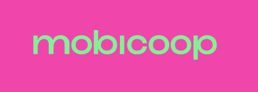

Mobicoop Bundle
=======

### About Mobicoop Bundle

Bundle contain the main source code for front mobicoop app

### Requirements 💻

- PHP: =>7.1
- Composer =>1.7
- Node.js => 10
- xdebug (needed for code-coverage)
- Google Chrome (for functionnals tests)

- for Windows check the [windows requirement](#windows-requirements) part
- Have at least a Symfony skeleton project

### install

Check the [monorepo install](../../../../)

### Configuring your bundle ⚙

**Add all of theses things to your Symfony project**

##### **/composer.json of the project**

        "autoload": {
            "psr-4": {
                [...],
                "Covivo\\Bundle\\Mobicoop\\":"vendor/covivo/mobicoop"
            }
        },
        "autoload-dev": {
            "psr-4": {
                [...],
                "Covivo\\Bundle\\Mobicoop\\":"vendor/covivo/mobicoop"
            }
            

##### **/config/bundles.php**

`Covivo\Bundle\Mobicoop\CovivoMobicoopBundle::class => ['all' => true],`
    

##### **/config/routes.yaml** 
*in order to link annotations of the bundle controllers to the project*

- first add this to your controllers (where you have written all your routes) :

`use Sensio\Bundle\FrameworkExtraBundle\Configuration\Method;`
    
    
- & then you can write down in Routes.yaml :

    
        app_annotations:
            # loads routes from the PHP annotations of the controllers found in that directory
            resource: '../src/MobicoopBundle/Controller/'
            type:     annotation

### **Routing**

If your template.html.twig is in *MobicoopBundle/Resources/views* you should return this in your controller :

`return $this->render('@Mobicoop/template.html.twig');` 

*If you get the error "Attempted to load class " Bundle" from namespace "Name\Bundle\Name". Did you forget a "use" statement for another namespace?"*

`composer dump-autoload`

### **Routing**

If your index.html.twig is in *Your_Bundle/Resources/views*

`return $this->render('@NameName/index.html.twig');`

### Use bundle elsewhere

To contribute to the mobicoop bundle application, please do the following:

1. Git clone the monorepo
2. Create a symlink to the bundle in your app (you can use the script provied in monorepo)

### Contribute Guideline 📖📚

Please check:

- [JS GuideLine](https://github.com/airbnb/javascript#whitespace) 
- [Symfony GuideLine](https://symfony.com/doc/current/contributing/code/standards.html)

and [contributor covenant](https://www.contributor-covenant.org)

*To check & fix your code*, just do:

`npm run testFixAndCoverage`

### Licence
Mobicoop software is owned by Mobicoop cooperative. Mobicoop cooperative is opened to any individual, company or public authority who wish to become a shareholder.
In order to increase the impact of our platform to any sort of clients whatever type of contractual relationship theyu require, Mobicoop software is dual-licensed:
 - [AGPL-3](https://www.gnu.org/licenses/agpl-3.0)
 - proprietary software
